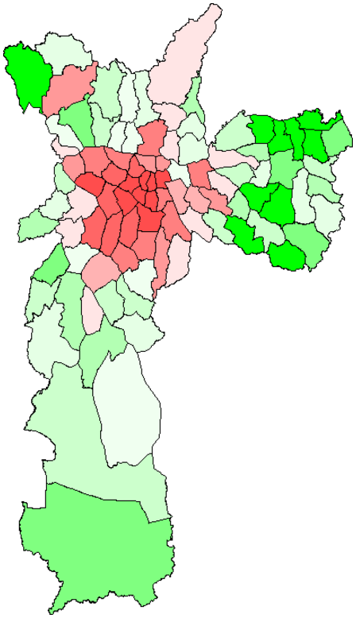
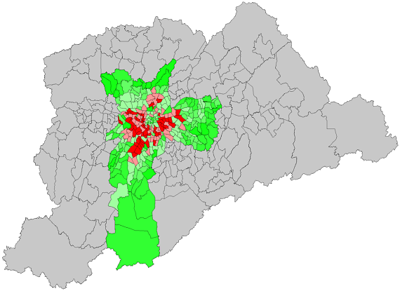

Map x Data Plotting
============
This is a simple project for data visualization with maps using python (on Jupyter Notebook).

It takes in shapefiles (.shp) and data - mainly excel spreadsheets - and plots with color-coding. Basically heatmaps.

Household Tax Variation in São Paulo city - 2014
--------

This is a visual representation of the household tax variation in all of São Paulo city's districts.

Age Distribution in São Paulo city
--------

This is a heatmap of elder citzens of São Paulo city. You can see central - more traditional - areas of the city have a greater concentration of the elderly.